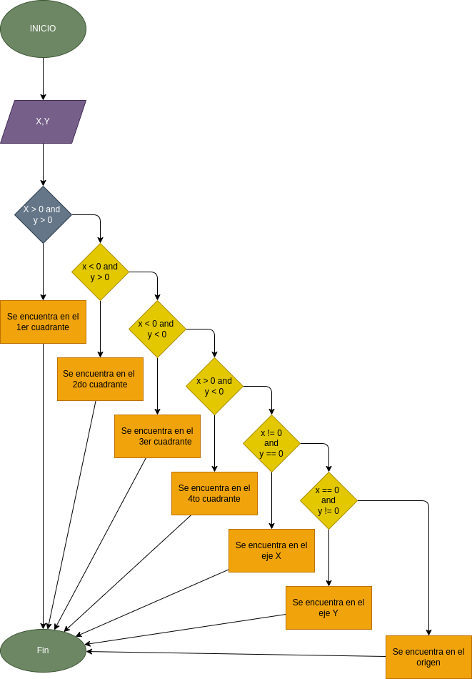

# Ejercicio. BUSQUEDA DE COORDENADAS EN EL PLANO CARTESIANO

## Definición de variables

x = cualquier número que este en el eje x

y = cualquier número que este en el eje y

### Diagrama de flujo

